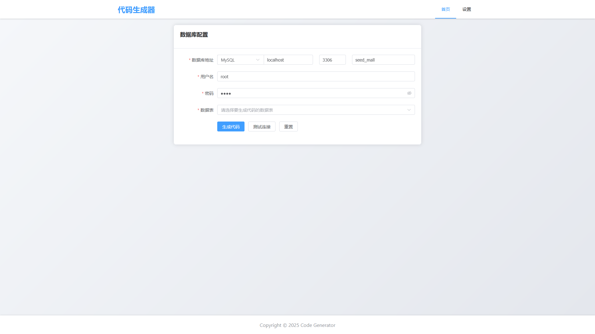
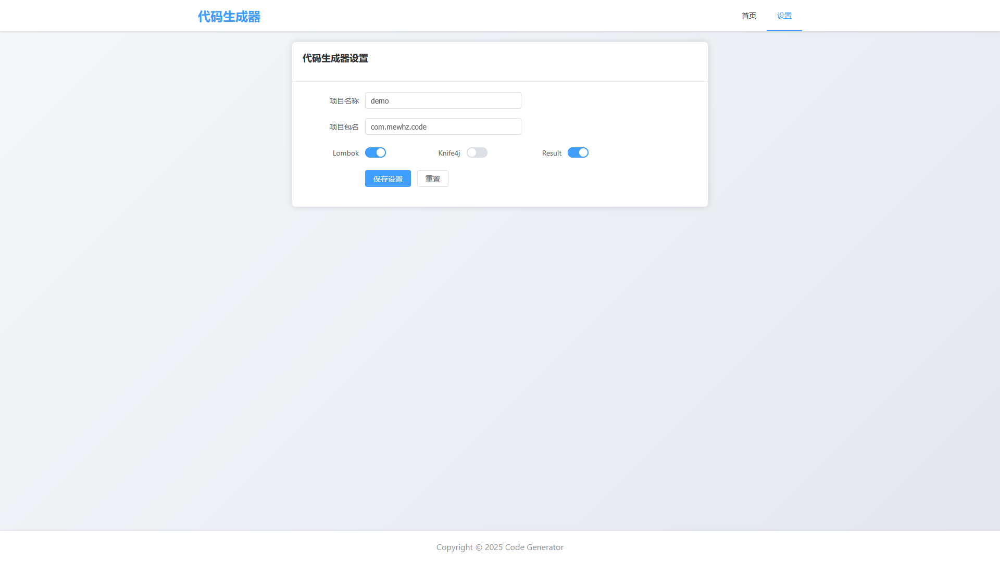

### 项目目录

code-generator
├─generator	-- 后端
└─ui	  	-- 前端 

### 项目运行

```bash
# 前端
pnpm install
pnpm run dev
```

后端放入 IDEA 中，下载依赖后运行

```bash
# jar 包内包含前端与后端，可直接通过命令运行使用
java -jar generator.jar
```

### 页面截图





### 更新记录

- v1.3.1 - 2025-05-30
  - 修复不选中 Result 时，依然返回 Result 的问题
  - 删除页面中 "数据校验" 和 "PostgreSQL" 选项和后台对应属性
  - 新增设置项目包名功能

 - v1.3.0 - 2025-03-30
   - 修复 Chrome 无法下载的问题
   - 修复下载时会出现时间戳偏差的问题
   - 新增自定义项目名，默认为 demo
   - 使用项目名作为生成后下载的文件夹名
 - v1.2.0 - 2025-02-23
   - 修复不启用 Lombok 时，Controller 和 ServiceImpl 中依然调用了 Lombok 注解的问题
   - Lombok 默认启用
   - 新增是否启用 Result
   - 新增生成时附带启动类和配置文件
 - v1.1.0 - 2025-02-23
   - 注销已经使用过的数据源
   - 新增是否启用 Lombok
   - 下载文件名修改为包含时间戳
   - 新增是否启用 Knife4j
 - v1.0.0 - 2025-02-21
   - 根据数据库信息生成 CRUD
   - 默认使用 MyBatis-Plus、Lombok
   - 生成 Controller、Service、Mapper 和 Model
   - 生成 MyBatis-Plus 的 Config 配置文件